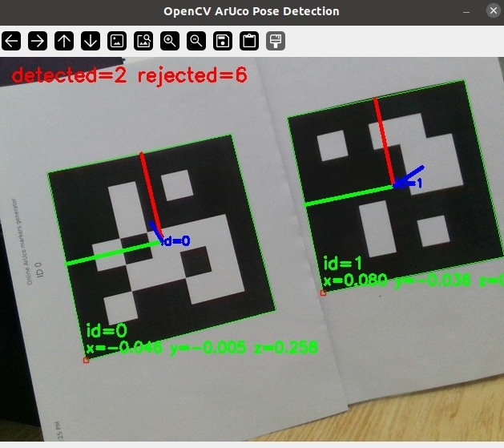

# Aruco Marker Pose Detection



## Marker
Download makers at https://chev.me/arucogen/ and print them. The markers shown in the picture are 
```
Dictionary: 5x5(50,100,250,1000)
Marker ID: 0 and 0
Marker size, mm: 100
```
## Python dependencies

Install the required Python packages:

```bash
pip install numpy opencv-contrib-python pyrealsense2
```

### Camera
Realsense D415

### To run

```
python rs_aruco.py
python rs_color_test.py

```